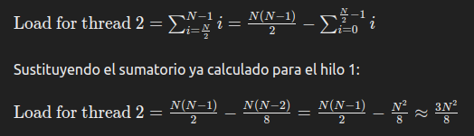
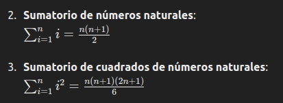

# 1. Important Terms

* **Temporal locality and Spatial locality:**
  * Temporal locality: refers to the tendency of programs to reuse data elements that have recently been used. Thus recently used data elements are stored high up in the cache hierarchy.
  * Spatial locality: refers to the tendency of programs to use data elements that are stored close in memory to recently used elements. Thus the system loads not only an element that is to be used, but also elements that are stored close by (i.e. in the same cache line) and stores these high up in the cache hierarchy.
  * How one can exploit both of these concepts when writing sequential code for matrix multiplication?: In standard matrix multiplication, AxB, spatial locality is exploited by loading cache lines of A and B into cache. Unless B has been transposed this only helps the access to A. Temporal locality only has an effect if A (or the transposed B) is sufciently small that an entire row can be stored in memory.
    To exploit both types of locality multiplication should be done by dividing A and B into smaller blocks. If the elements of each block is stored consecutively then two blocks of suf ciently small size n2 can be stored in the cache hierarchy and be used to perform n3 operations.

---

* **False sharing**
  * False sharing refers to when different threads are accessing elements on the same cache line. As the smallest unit of memory is a cache line this means that the same cache line will be moved between the caches of the different threads even though they are not writing to the same elements. This can be prevented by partitioning the data so that the cache lines containing data that a thread is writing to does not contain elements that other threads are writing to. A static partitioning will typically achieve this. It is also possible to pad an array with dummy elements to ensure that there is no overlap (measured in cache lines) between the working area of two threads.

---

* **Speedup**
  * Speedup is a measure of how much faster a parallel program is compared to a sequential one for solving the same problem. Speedup is a function of the number of threads used and also the size of the problem. It is calculated as S(n,p) = T(n)/Tp(n)
  * Measure: In a theoretical setting one would use the running time of the programs measured with O-notation (or a more exact expression). In a practical setting one would use the wall-clock time to calculate the speedup.

---

* **Latency and bandwidth in parallel computers with distributed memory**
  * Latency: When sending data from between two processes latency is the time from when the first data item is sent until it starts arriving at its destination
  * Bandwidth: is the capacity of the communication channel used. This measures how much data (in bytes) can be sent per time unit once the communication channel is stablished

---

* **How can Schedules affect SpeedUp in pragma omp**

  * If the work is not balanced and we choose a static scheduled, the amount of work will be very different between the threads and therefore the speedup will be far away for optimal, as some threads will just be waiting for others to finish
  * If the inner loops can have different number of operations inside, probably the dynamic, guided or auto schedule will fit better
  * An example: We have 2 loops, The outmost one goes from i=0 to i<N and the inner one goes from j=0 to j<i. As we can see the last values of i will computate more operations than the first ones, therefore the work is unbalanced. This will also apply if for example we are doing some operations inside the outmost loop that can take different running time, making some threads finish earlier than other.
    For the given problem of having the i-loop going from i=0 to N, and j-loop going from j=0 to i, the expected speedup for using 2 threads for the different approaches would be:
    Aproximate total work: N²/2
    * Static:

      * First thread

        
      * Second thread would do:

        
      * Therefore the total speedup would be given my this second thread: (N²/2) / (3N²/8) = 4/3 = 1.33
    * Dynamic: 1.8 - 1.9
    * Guided: 1.7 - 1.9
    * Auto: 1.8 - 2

  

---

* **In practice it is possible to get higher speedup than p when using p processes?**
  * Yes, this can happen because we now get access to more memory and the sequential parts can execute faster.

---

* **How different languages stored rows/columns when loading a value:**

  * C, Java stores them in rows
  * Fortram and Matlab loads columns

  ---
* **Moore's law (Number of transistors)**

  * Moore´s law says that the number of transistors in a given area will double every 18th month

---

* **Generating a random number in parallel region:**

  * If we are generating random numbers in a parallel region it would be probable that all threads use the same seed and then get the same sequence of pseudorandom numbers
  * This can be solved having a **centralized** thread that would be in charge of generating the random numbers (may cause many request), or a **distributed** making sure each thread recieves a different sequence.
  * srandom(),random() are for sequential program. For parallel srandom_r(), random_r(): are thread safe functions, generates different sequences on different threads. Slightly more complicated to use.

---

# **Sorting Algorithms:**

* **Θ(n^2) algorithms:**

  * 1. **Selection sort**

    * Repeatedly selects the smallest (or largest) element from the unsorted portion and swaps it with the first unsorted element.
    * Simple and easy to understand, useful for small datasets or when memory space is very limited.

  ---


  * 2. **Bubble sort**

    * Repeatedly steps through the list, compares adjacent elements, and swaps them if they are in the wrong order. This process is repeated until the list is sorted.
    * Simple but inefficient for large lists. Can detect a sorted list and stop early.

  ---

  * 3. **Insertion sort**

    * Builds the sorted array one element at a time by repeatedly picking the next element and inserting it into its correct position.
    * Efficient for small datasets or nearly sorted data. Often used in practice for small auxiliary arrays in more complex algorithms like quicksort.

---

* **O(n log n) algorithms:**

  * 1. **Quicksort**

    * Divides the array into two smaller sub-arrays (low and high elements) around a pivot element and then recursively sorts the sub-arrays.
    * Highly efficient for large datasets and widely used due to its average-case performance and cache efficiency.

  ---


  * 2. **Mergesort**

    * Divides the array into two halves, recursively sorts each half, and then merges the two sorted halves.
    * Preferred for sorting linked lists and when stable sorting is required. Good for large datasets.

  ---

  * 3. **Heapsort**

    * Converts the array into a max-heap and then repeatedly extracts the maximum element from the heap, placing it at the end of the array.
    * Useful for applications needing guaranteed O(n log n) performance and limited additional space.

---

* **Other sorting algorithms**

  * 1. **Counting sort**

    * Counts the occurrences of each distinct element and uses this information to place the elements into the correct positions.
    * Efficient for sorting integers within a small range. Not suitable for large ranges or floating-point numbers.

  ---


  * 2. **Radixsort**

    * Sorts the numbers digit by digit, starting from the least significant digit to the most significant digit, using a stable counting sort as a subroutine.
    * Useful for sorting large numbers of integers or strings with a fixed length.

  ---

  * 3. **Bucketsort**

    * Distributes elements into a number of buckets, sorts each bucket individually (often using another sorting algorithm like insertion sort), and then concatenates the sorted buckets.
    * Effective for uniformly distributed data over a range. Commonly used for floating-point numbers in the range [0, 1).

  ---

---

# 2. OpenMP Reductions

* Each thread gets its private copy of the `General` variable.
* Threads compute their partial operations independently.
* At the end of the parallel region, OpenMP combines these private variable using the specified operation and stores the result in the shared `General` variable.

## Types of Reductions in OpenMP

OpenMP supports several types of reductions that can be specified using the `reduction` clause in a parallel construct. The reduction clause allows for a shared variable to be reduced across all threads in a specified manner. Here are the different types of reduction operations available in OpenMP:

### 1. Arithmetic Reductions

- **`+`**: Sum reduction.
- **`-`**: Subtraction reduction.
- **`*`**: Product reduction.

**Example**:

```c
#pragma omp parallel for reduction(+:sum)
for (int i = 0; i < n; i++) {
    sum += array[i];
}
```

### 2. Logical Reductions

- **`&&`**: Logical AND reduction.
- **`||`**: Logical OR reduction.

**Example**:

```c
#pragma omp parallel for reduction(&&:all_positive)
for (int i = 0; i < n; i++) {
    all_positive = all_positive && (array[i] > 0);
}
```

### 3. Bitwise Reductions

- **`&`**: Bitwise AND reduction.
- **`|`**: Bitwise OR reduction.
- **`^`**: Bitwise XOR reduction.

**Example**:

```c
#pragma omp parallel for reduction(|:result)
for (int i = 0; i < n; i++) {
    result |= array[i];
}
```

### 4. Min/Max Reductions (Custom)

OpenMP does not have built-in `min` and `max` reduction operators, but you can define custom reduction operations using `declare reduction`.

## Custom Reduction Example: Maximum Value of a List

To find the maximum value in an array using a custom reduction in OpenMP, you can use the `declare reduction` directive to define a custom reduction operation. Here’s how you can do it:

### Custom Maximum Reduction Example

**Code**:

```c
#include <stdio.h>
#include <limits.h> // For INT_MAX
#include <omp.h>

#define N 1000000
int data[N];

// Function to find the minimum element in the array
int find_min() {
    int i;
    int min_val = INT_MAX;

    // Initialize array with some values (for example purposes, we use values from N to 1)
    for (i = 0; i < N; i++) {
        data[i] = N - i;
    }

    // Declare the user-defined reduction operation for finding the minimum
    #pragma omp declare reduction(minimum : int : omp_out = omp_in < omp_out ? omp_in : omp_out) initializer(omp_priv = INT_MAX)

    // Parallel loop with minimum reduction
    #pragma omp parallel for reduction(minimum:min_val)
    for (i = 0; i < N; i++) {
        if (data[i] < min_val) {
            min_val = data[i];
        }
    }

    return min_val;
}

int main() {
    int min_element = find_min();
    printf("Minimum element: %d\n", min_element);
    return 0;
}

```

## Explanation

1. **User-Defined Reduction** :

* The `#pragma omp declare reduction(minimum : int : omp_out = omp_in < omp_out ? omp_in : omp_out) initializer(omp_priv = INT_MAX)` directive declares a user-defined reduction operation named `minimum` for type `int`.
  * `omp_out` is the variable that holds the combined result.
  * `omp_in` is the variable that holds the partial result from each thread.
  * The combiner `omp_out = omp_in < omp_out ? omp_in : omp_out` ensures that `omp_out` will always hold the minimum value.
  * The initializer clause `initializer(omp_priv = INT_MAX)` initializes the private copies of the reduction variable to `INT_MAX`.

2. **Parallel Loop** :

* The `#pragma omp parallel for reduction(minimum:min_val)` directive tells the compiler to parallelize the loop and perform a minimum reduction on the `min_val` variable.
  * Each thread gets its private copy of `min_val` initialized to `INT_MAX`.
  * Threads independently compare their elements of the array to find the local minimum.
  * At the end of the parallel region, OpenMP combines these local minima using the `minimum` operation and stores the result in the shared `min_val` variable.

## Summary

OpenMP supports various reduction operations, including arithmetic, logical, and bitwise reductions. For more complex reductions like finding the maximum or minimum value, custom reductions can be implemented using the `declare reduction` directive. This allows for flexibility and extensibility in performing reductions across multiple threads.

# 3. OpenMP Schedules

### **Static Schedule**

**Description**: The iterations of the loop are divided into chunks of a fixed size and assigned to threads in a round-robin manner before the loop starts.

**Syntax**:

```c
#pragma omp for schedule(static, chunk_size)
```

**Behavior**:

- If `chunk_size` is specified, each thread is assigned `chunk_size` iterations in a round-robin fashion.
- If `chunk_size` is not specified, the iterations are divided evenly among the threads.

**Impact on Speed**:

- **Pros**: Good for loops where the iteration workload is uniform and predictable.
- **Cons**: Can lead to load imbalance if the workload varies significantly between iterations.

**Example**:

```c
#pragma omp parallel for schedule(static, 4)
for (int i = 0; i < 16; i++) {
    // Loop body
}
```

---

### **Dynamic Schedule**

**Description**: Iterations are divided into chunks and assigned to threads as they become available. Each thread requests a chunk of iterations when it finishes its current chunk.

**Syntax**:

```c
#pragma omp for schedule(dynamic, chunk_size)
```

**Behavior**:

- If `chunk_size` is specified, each thread gets `chunk_size` iterations.
- If `chunk_size` is not specified, the default chunk size is 1.

**Impact on Speed**:

- **Pros**: Good for loops with unpredictable or varying workloads, as it helps balance the load among threads.
- **Cons**: Higher scheduling overhead compared to static scheduling.

**Example**:

```c
#pragma omp parallel for schedule(dynamic, 4)
for (int i = 0; i < 16; i++) {
    // Loop body
}
```

---

### **Guided Schedule**

**Description**: Similar to dynamic scheduling, but the chunk size decreases over time. Initially, larger chunks are assigned to threads, and the chunk size gets smaller as the execution progresses.

**Syntax**:

```c
#pragma omp for schedule(guided, chunk_size)
```

**Behavior**:

- The chunk size is proportional to the number of unassigned iterations divided by the number of threads, but at least `chunk_size`.

**Impact on Speed**:

- **Pros**: Useful for loops with decreasing workloads or where initial iterations take longer.
- **Cons**: Still has scheduling overhead, but can be more balanced than dynamic for certain workloads.

**Example**:

```c
#pragma omp parallel for schedule(guided, 4)
for (int i = 0; i < 16; i++) {
    // Loop body
}
```

---

### **Auto Schedule**

**Description**: The scheduling decision is left to the compiler and runtime system. The compiler decides the best schedule to use based on the code and system characteristics.

**Syntax**:

```c
#pragma omp for schedule(auto)
```

**Behavior**:

- The compiler/runtime system determines the schedule.

**Impact on Speed**:

- **Pros**: Allows the compiler/runtime to optimize the schedule for the given system and workload.
- **Cons**: Less control for the programmer, and the actual schedule used may be opaque.

**Example**:

```c
#pragma omp parallel for schedule(auto)
for (int i = 0; i < 16; i++) {
    // Loop body
}
```

---

### **Runtime Schedule**

**Description**: The schedule is determined at runtime based on the value of the environment variable `OMP_SCHEDULE`.

**Syntax**:

```c
#pragma omp for schedule(runtime)
```

**Behavior**:

- The actual schedule and chunk size are set by the environment variable `OMP_SCHEDULE` (e.g., `export OMP_SCHEDULE="dynamic,4"`).

**Impact on Speed**:

- **Pros**: Flexibility to change the schedule without recompiling the code.
- **Cons**: Requires setting and managing environment variables.

**Example**:

```c
#pragma omp parallel for schedule(runtime)
for (int i = 0; i < 16; i++) {
    // Loop body
}
```

---

# 4. MPI Functions

### **1. MPI_Init and MPI_Finalize**

**Purpose**: Initializes and terminates the MPI execution environment. The Init function must be called before any other MPI functions and the Finalize before exiting the problem, and no more MPI calls can be done after that.

**Arguments**:

- `argc` (int*): Pointer to the number of arguments.
- `argv` (char***): Pointer to the array of argument strings.

**Example**:

```c
#include <mpi.h>
#include <stdio.h>

int main(int argc, char **argv) {
    MPI_Init(&argc, &argv);
    // Other MPI code here
    MPI_Finalize();
    return 0;
}
```

---

### **2. MPI_Comm_rank**

**Purpose**: Determines the rank (ID) of the calling process within the communicator.

**Arguments**:

- `comm` (MPI_Comm): Communicator.
- `rank` (int*): Pointer to the rank of the calling process.

**Example**:

```c
#include <mpi.h>
#include <stdio.h>

int main(int argc, char **argv) {
    MPI_Init(&argc, &argv);
    int rank;
    MPI_Comm_rank(MPI_COMM_WORLD, &rank);
    printf("Process rank: %d\n", rank);
    MPI_Finalize();
    return 0;
}
```

---

### **3. MPI_Comm_size**

**Purpose**: Determines the number of processes in the communicator.

**Arguments**:

- `comm` (MPI_Comm): Communicator.
- `size` (int*): Pointer to the number of processes.

**Example**:

```c
#include <mpi.h>
#include <stdio.h>

int main(int argc, char **argv) {
    MPI_Init(&argc, &argv);
    int size;
    MPI_Comm_size(MPI_COMM_WORLD, &size);
    printf("Number of processes: %d\n", size);
    MPI_Finalize();
    return 0;
}
```

---

### **4. MPI_Send**

**Purpose**: Sends a message to a specified process.

**Arguments**:

- `buf` (void*): Initial address of the send buffer.
- `count` (int): Number of elements in the send buffer.
- `datatype` (MPI_Datatype): Data type of each send buffer element.
- `dest` (int): Rank of the destination process.
- `tag` (int): Message tag.
- `comm` (MPI_Comm): Communicator.

**Example**:

```c
#include <mpi.h>
#include <stdio.h>

int main(int argc, char **argv) {
    MPI_Init(&argc, &argv);
    int rank;
    MPI_Comm_rank(MPI_COMM_WORLD, &rank);

    int data = 100;
    if (rank == 0) {
        MPI_Send(&data, 1, MPI_INT, 1, 0, MPI_COMM_WORLD);
    }
  
    MPI_Finalize();
    return 0;
}
```

---

### **5. MPI_Recv**

**Purpose**: Receives a message from a specified process.

**Arguments**:

- `buf` (void*): Initial address of the receive buffer.
- `count` (int): Maximum number of elements in the receive buffer.
- `datatype` (MPI_Datatype): Data type of each receive buffer element.
- `source` (int): Rank of the source process.
- `tag` (int): Message tag.
- `comm` (MPI_Comm): Communicator.
- `status` (MPI_Status*): Status object.

**Example**:

```c
#include <mpi.h>
#include <stdio.h>

int main(int argc, char **argv) {
    MPI_Init(&argc, &argv);
    int rank;
    MPI_Comm_rank(MPI_COMM_WORLD, &rank);

    int data;
    MPI_Status status;
    if (rank == 1) {
        MPI_Recv(&data, 1, MPI_INT, 0, 0, MPI_COMM_WORLD, &status);
        printf("Received data: %d\n", data);
    }

    MPI_Finalize();
    return 0;
}
```

---

### **6. MPI_Reduce**

**Purpose**: Reduces values on all processes to a single value on the root process.

**Arguments**:

- `sendbuf` (void*): Address of the send buffer.
- `recvbuf` (void*): Address of the receive buffer (only relevant on root).
- `count` (int): Number of elements in the send buffer.
- `datatype` (MPI_Datatype): Data type of each element in the send buffer.
- `op` (MPI_Op): Operation to apply.
- `root` (int): Rank of the root process.
- `comm` (MPI_Comm): Communicator.

**Example**:

```c
#include <mpi.h>
#include <stdio.h>

int main(int argc, char **argv) {
    MPI_Init(&argc, &argv);
    int rank, size;
    MPI_Comm_rank(MPI_COMM_WORLD, &rank);
    MPI_Comm_size(MPI_COMM_WORLD, &size);

    int data = rank;
    int sum;
    MPI_Reduce(&data, &sum, 1, MPI_INT, MPI_SUM, 0, MPI_COMM_WORLD);

    if (rank == 0) {
        printf("Sum of ranks: %d\n", sum);
    }

    MPI_Finalize();
    return 0;
}
```

---

### **7. MPI_Bcast**

**Purpose**: Broadcasts a message from the root process to all other processes in the communicator.

**Arguments**:

- `buffer` (void*): Initial address of the buffer.
- `count` (int): Number of entries in the buffer.
- `datatype` (MPI_Datatype): Data type of buffer entries.
- `root` (int): Rank of the root process.
- `comm` (MPI_Comm): Communicator.

**Example**:

```c
#include <mpi.h>
#include <stdio.h>

int main(int argc, char **argv) {
    MPI_Init(&argc, &argv);
    int rank;
    MPI_Comm_rank(MPI_COMM_WORLD, &rank);

    int data;
    if (rank == 0) {
        data = 100;
    }
    MPI_Bcast(&data, 1, MPI_INT, 0, MPI_COMM_WORLD);
    printf("Process %d received data: %d\n", rank, data);

    MPI_Finalize();
    return 0;
}
```

---

### **8. MPI_Scatter**

**Purpose**: Distributes distinct chunks of data from the root process to all other processes in the communicator.

**Arguments**:

- `sendbuf` (void*): Address of the send buffer (significant only at root).
- `sendcount` (int): Number of elements sent to each process.
- `sendtype` (MPI_Datatype): Data type of send buffer elements.
- `recvbuf` (void*): Address of the receive buffer.
- `recvcount` (int): Number of elements in the receive buffer.
- `recvtype` (MPI_Datatype): Data type of receive buffer elements.
- `root` (int): Rank of the root process.
- `comm` (MPI_Comm): Communicator.

**Example**:

```c
#include <mpi.h>
#include <stdio.h>

int main(int argc, char **argv) {
    MPI_Init(&argc, &argv);
    int rank, size;
    MPI_Comm_rank(MPI_COMM_WORLD, &rank);
    MPI_Comm_size(MPI_COMM_WORLD, &size);

    int data[4] = {0, 1, 2, 3};
    int recv_data;
    MPI_Scatter(data, 1, MPI_INT, &recv_data, 1, MPI_INT, 0, MPI_COMM_WORLD);
    printf("Process %d received data: %d\n", rank, recv_data);

    MPI_Finalize();
    return 0;
}
```

---

### **9. MPI_Gather**

**Purpose**: Gathers distinct chunks of data from all processes to the root process.

**Arguments**:

- `sendbuf` (void*): Initial address of the send buffer.
- `sendcount` (int): Number of elements in the send buffer.
- `sendtype` (MPI_Datatype): Data type of send buffer elements.
- `recvbuf` (void*): Address of the receive buffer (significant only at root).
- `recvcount` (int): Number of elements in the receive buffer.
- `recvtype` (MPI_Datatype): Data type of receive buffer elements.
- `root` (int): Rank of the root process.
- `comm` (MPI_Comm): Communicator.

**Example**:

```c
#include <mpi.h>
#include <stdio.h>

int main(int argc, char **argv) {
    MPI_Init(&argc, &argv);
    int rank, size;
    MPI_Comm_rank(MPI_COMM_WORLD, &rank);
    MPI_Comm_size(MPI_COMM_WORLD, &size);

    int send_data = rank;
    int recv_data[4];
    MPI_Gather(&send_data, 1, MPI_INT, recv_data, 1, MPI_INT, 0, MPI_COMM_WORLD);

    if (rank == 0) {
        printf("Gathered data: ");
        for (int i = 0; i < size; i++) {
            printf("%d ", recv_data[i]);
        }
        printf("\n");
    }

    MPI_Finalize();
    return 0;
}
```

---

### **10. MPI_Barrier**

**Purpose**: Blocks until all processes in the communicator have reached this routine.

**Arguments**:

- `comm` (MPI_Comm): Communicator.

**Example**:

```c
#include <mpi.h>
#include <stdio.h>

int main(int argc, char **argv) {
    MPI_Init(&argc, &argv);
    int rank;
    MPI_Comm_rank(MPI_COMM_WORLD, &rank);

    printf("Process %d before barrier\n", rank);
    MPI_Barrier(MPI_COMM_WORLD);
    printf("Process %d after barrier\n", rank);

    MPI_Finalize();
    return 0;
}
```

### Compile

mpicc -Wall -O3 -o prueba1 prueba1.c

### Execute

mpicc -o programa programa.c

### Measure Time

MPI_Wtime();

---

# GPU

- Specialized, only performs compute tasks
- Can run 1000+ threads simultaneously on one GPU processor
- Light weight threads: Hardware support for massive multi-threading.
- Works best when all the threads do the same thing (SIMD).

### In C we use CUDA

Developed by NVIDIA

**Function Modifiers** :

* `__global__`: Called by the host, executed by the GPU.
* `__device__`: Called and executed by the GPU only.

**Variable Modifiers** :

* `__shared__`: Variable in shared memory.
* `__device__`: Variable in global memory.
* Variables without modifiers in kernels are thread-local.

**Device Functions** :

* `__syncthreads()`: Sync of threads within a block, similar to `omp barrier`.

---

# Terminology

1. **Socket**: Where a (multicore) processor can be plugged in
2. **Multicore processor:**

   - A processor that can run several processes (i.e. threads) at the same time(one or two per core)
   - Each process has access to the same shared memory
   - Can have individual caches
3. **Thread:**

   - Light weight process: One processor can run multiple threads
4. **Hyper-threading:**

   - One processor (i.e. core) rapidly switching between multiple threads
5. **Scalability**

   - How does the program performance improve with increasing numbers of processes?
